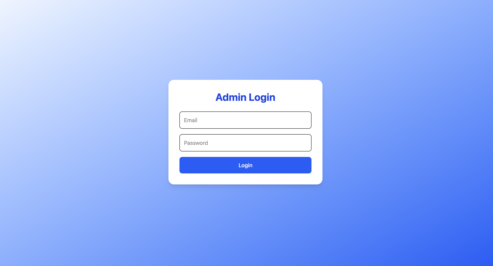
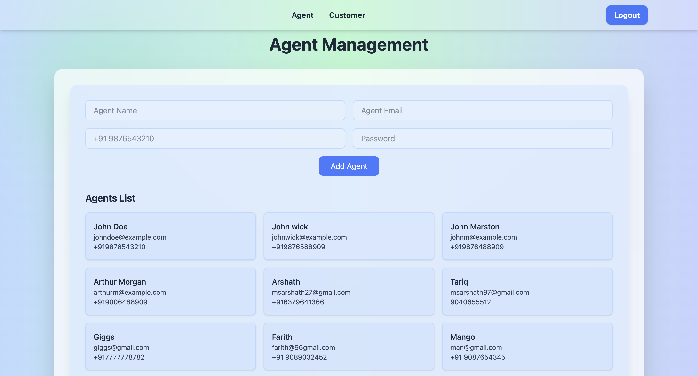
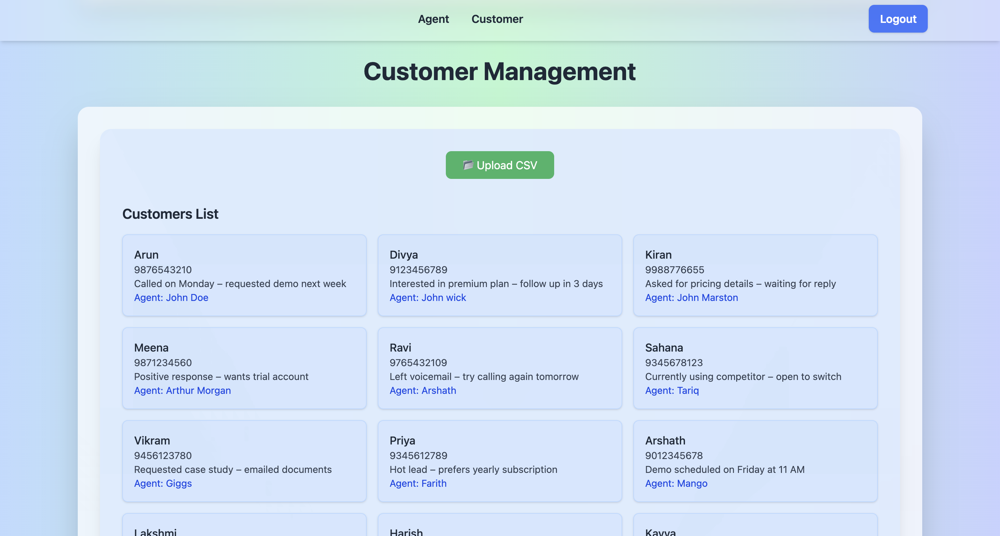

# MERN Stack CSV Distribution App

## Project Overview
This is a MERN stack application that allows an **Admin** to:
- Login securely
- Add and manage agents
- Upload CSV/XLS/XLSX lists and distribute tasks equally among agents

---

## Features

1. **Admin Login**
   - Email and Password authentication
   - JSON Web Token (JWT) authentication
   - Redirects to dashboard after successful login

2. **Agent Management**
   - Add agents with Name, Email, Mobile Number, and Password
   - View all agents

3. **CSV Upload & Task Distribution**
   - Upload CSV/XLS/XLSX files with columns: `FirstName`, `Phone`, `Notes`
   - Validates file type and CSV structure
   - Distributes tasks equally among 5 agents
   - Remaining tasks distributed sequentially
   - Tasks are stored in MongoDB and displayed per agent

---

## Technology Stack

- **Frontend:** React.js + Vite + TailwindCSS
- **Backend:** Node.js + Express.js
- **Database:** MongoDB
- **Authentication:** JWT
- **File Handling:** multer, csv-parser, xlsx

---

## Setup Instructions

### Clone Repository
```bash
git clone https://github.com/mohammedarshath2705/Machine-Test.git
cd Machine-Test
```

### Backend Setup
```bash
cd backend
npm install
```

### Create a .env file in backend/:
```bash
PORT=5000
MONGO_URI=<Your MongoDB Connection String>
JWT_SECRET=<Your JWT Secret Key>
```


### Start the backend server:
```bash
npm run dev
```
#### Backend runs at http://localhost:5000

### Frontend Setup
```bash
cd Frontend
npm install
```

### Create a .env file in frontend/:
```bash
VITE_API_URL=http://localhost:5000
```

### Start the Frontend server:
```bash
npm run dev
```
#### Frontend runs at http://localhost:5173 (default Vite port)

## Usage

1. Open the frontend in a browser.

2. Login as Admin.

3. Add agents in the "Agents" section.

4. Upload a CSV/XLS/XLSX list in the "Upload List" section.

5. View tasks distributed to each agent on the dashboard.
6. If you want a new user,register yourself in postman and then login

## API Endpoints

### `User`    Table

| Method | Endpoint     | Description                |
| :-------- | :------- | :------------------------- |
| `Post` | `/api/auth/register` |  Register with name,email and password
| `Post` | `/api/auth/login` | Login with email and password


### `Agent`    Table

| Method | Endpoint     | Description                |
| :-------- | :------- | :------------------------- |
| `Post` | `/api/agents` |  Add agents with name,email,mobile and password
| `GET` | `api/agents` | Get all agents


### `Customers`    Table

| Method | Endpoint     | Description                |
| :-------- | :------- | :------------------------- |
| `Post` | `/api/customers/upload` |  Upload CSV/XLS/XLSX and distribute tasks among agents
| `GET` | `/api/customers` | Get all Customers with Agent info

## Example EndPoints

#### 1 . Register a new user

```http
  POST /api/auth/register
```
#### Body(JSON) : 
```json
{
  "name": "Admin Name",
  "email": "admin@example.com",
  "password": "yourpassword"
}
```
#### 1 . Login

```http
  POST /api/auth/login
```
#### Body(JSON) : 
```json
{
  "email": "admin@example.com",
  "password": "yourpassword"
}
```

#### Response : 
```json
{
   "token": "<JWT Token>"
}
```

#### 3 . Add agent

```http
  POST /api/agents
```

#### Body(JSON) : 
```json
{
  "name": "Agent Name",
  "email": "agent@example.com",
  "phone": "+911234567890",
  "password": "agentpassword"
}
```
#### 4 . Get agent

```http
  GET /api/agents
```
#### Body(JSON) : 
```json
{
  "name": "Agent Name",
  "email": "agent@example.com",
  "phone": "+911234567890",
}
```
#### 5.Upload Customers CSV

```http
  Post /api/customers/upload
```
- Form Data:
  - Key: file
  - Value: Upload CSV/XLS/XLSX file

#### 6.Get Customers with Agent Info

```http
  Get /api/customers/
```
#### Body(JSON) : 
```json
[
  {
    "firstName": "John",
    "phone": "+911234567890",
    "notes": "Follow up tomorrow",
    "agent": {
      "name": "Agent Name",
      "email": "agent@example.com"
    }
  }
]
```
## Credentials 

- ### Login :
  -  email : admin1@gmail.com
  -  password : Secret123
- ### Example CSV for Upload
   - You can use this sample CSV to test the upload feature :
     [Download customers.csv](assets/customers.csv)


## Validation & Error Handling

- Only authenticated users can access dashboard routes.
- File validation: Only CSV/XLS/XLSX allowed.
- Required columns for CSV/XLS/XLSX: `FirstName`, `Phone`, `Notes`.
- Frontend displays appropriate error messages for:
  - Invalid login credentials
  - Invalid file type or missing columns
  - Server errors

## Video Demonstration
[Click here to view demo](<Google Drive Link>)

## Deployment

- **Backend:** Hosted on Render  
  - API Base URL: `https://machine-test-fq7p.onrender.com`

- **Frontend:** Hosted on Vercel  
  - Live URL: `https://machine-test-flax.vercel.app/`

**Notes:**
- Make sure your frontend is using the deployed backend URL in `.env`:
```env
VITE_API_URL=https://machine-test-fq7p.onrender.com
```

## Screenshots

### Login Page


### Admin Dashboard and Agent


### CSV Upload Page



